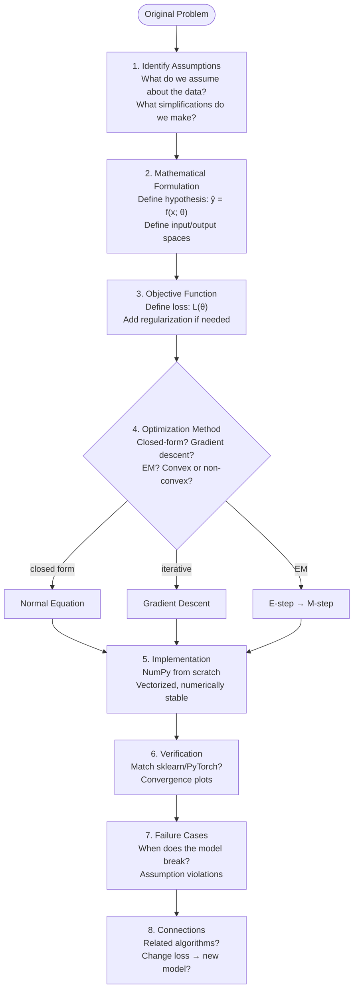

# Contributing / Process Notes

This is a solo learning workspace, so this file is primarily a process contract
with future-me (and any curious visitor). The authoritative rules live in
[CLAUDE.md](https://github.com/hien078/Machine-Learning-from-scratch/blob/master/CLAUDE.md)/[AGENTS.md](https://github.com/hien078/Machine-Learning-from-scratch/blob/master/AGENTS.md);
the notebook quality contract is the Notebook Standards section below.

## Setup

See [README.md](README.md), "Quick Start & Installation" — `requirements.txt` pins the
notebook runtime, `pip install -e ".[dev]"` adds the library plus test/lint/type tooling.

## Quality gates (all must pass before pushing)

```bash
mlfp check
```

Runs lint, format, notebook format, types, library tests with the coverage floor,
and project tests — in that order, continuing past failures and naming every gate
that failed. CI runs this exact script, so green locally means green in CI.

Notebook content changes additionally require a fresh-kernel pass:

```bash
mlfp nb-exec --only <path> --write   # canonical outputs
mlfp nb-exec                         # full read-only sweep
```

Committed notebook outputs may ONLY come from `execute_all_notebooks.py --write`
— never from an interactive kernel (Notebook Standards §7/§11 below).

## Code conventions

General Python style — `from __future__ import annotations`, type hints on signatures,
Google-style docstrings on public API — is [AGENTS.md](https://github.com/hien078/Machine-Learning-from-scratch/blob/master/AGENTS.md) §8. Where content
belongs (theory vs notebook vs `src/`) is Notebook Standards §2 below.

Specific to this library:

- NumPy `NDArray` typing on array parameters and returns.
- `ValueError` for bad arguments, `RuntimeError` for not-fitted state.
- New public names go into the alphabetized `__all__` in
  `src/ml_first_principles/__init__.py` (a test enforces it resolves).
- Additive, non-breaking API changes preferred; breaking changes need a
  CHANGELOG entry and a version bump discussion.

## Release procedure (maintainer)

1. Move CHANGELOG `[Unreleased]` into a new `[x.y.z]` section (Keep a Changelog).
2. Bump `version` in `pyproject.toml` AND `__version__` in
   `src/ml_first_principles/__init__.py` (a test fails if they diverge).
3. `python -m build` → sdist + wheel in `dist/`.
4. `git tag vx.y.z && git push origin master --tags`.
5. `gh release create vx.y.z dist/* --title vx.y.z --notes-file <notes>`.
6. No PyPI (see the decisions log below); TestPyPI once as a learning exercise
   is allowed.

---

# Ecosystem Roadmap

> From a 22-topic first-principles curriculum to a complete learning ecosystem:
> verified curriculum, reusable library, applied projects, published docs.

Per-topic maturity lives in [INDEX.md](INDEX.md); what each release shipped lives in
[CHANGELOG.md](CHANGELOG.md).

| Phase | Pillar | Goal | Status |
|---|---|---|---|
| 1 | Infrastructure | Verification foundation | ✅ Done |
| 2 | Curriculum | Curriculum hardening | 🟡 Content done, CI streak pending |
| 3 | Publishing | Docs site | ✅ Done |
| 4 | Projects | Applied capstone projects | ✅ Done |
| 5 | Library | v0.2.0 + release | ✅ Done |

Per-phase task checklists are finished work; they stay in git history rather than
here, and their outcome is recorded in CHANGELOG.md.

## Open

- **Phase 2 exit criterion — CI streak.** All 22 topics are Verified in INDEX.md and
  `topics/synthesis/` covers all 5 curriculum phases. What remains is the weekly notebook
  execution job (`.github/workflows/ci.yml`, `notebooks`) staying green 3 consecutive
  weeks.

## Decisions Log

- **Infra before content** (2026-08): the Verified gate was undefined while the standards demanded cleared outputs and the tree deliberately kept them; the expensive full re-execution sweep should happen exactly once, after the policy is settled.
- **Outputs stay committed** (2026-08): GitHub browsing is self-contained and the docs site can render notebooks without executing them at build time. The invariant is not *no outputs* but *no hand-run stale outputs* — `execute_all_notebooks.py --write` is the only legitimate producer.
- **Inline matplotlib backend for `--write`** (2026-08): the headless sweep originally forced `MPLBACKEND=Agg`, which is non-interactive — every `plt.show()` committed a `FigureCanvasAgg` warning and no image, leaving the tree with zero figures. `module://matplotlib_inline.backend_inline` is equally headless and deterministic but captures figures.
- **MkDocs Material over Jupyter Book/Quarto** (2026-08): both alternatives require converting the ```math fences that were just adopted for GitHub rendering; Material renders them with config only.
- **Flat library namespace retained** (2026-08): 17 modules with a curated `__all__` is within flat-namespace comfort; revisit past ~25 modules.
- **No PyPI** (2026-08): solo learning repo — GitHub Releases carry the artifacts; one TestPyPI upload allowed as a learning exercise, not institutionalized.
- **Single source per fact** (2026-08): the topic list, the agent guidelines, and the dependency set each had 2–4 hand-synced copies. Each now has one owner — INDEX.md, AGENTS.md, and pyproject.toml respectively — and the others link to it.
- **Process docs merged** (2026-08): ROADMAP.md folded into this file. Both were process contracts with future-me, and a roadmap whose phases are all done is not a second document. Kept at repo root rather than `.github/` because `docs/` is a symlink farm rooted at the repo root — a `.github/` location would break relative links in either the GitHub view or the docs site.

---

# Notebook Standards

The quality contract for active curriculum content (referenced elsewhere as
"Notebook Standards §N"). Repository-level instructions in `AGENTS.md` and
`CLAUDE.md` take precedence if a conflict remains.

## 1. First Principles Contract

Every completed topic must answer these questions in order:

| Stage | Required question | Primary location |
|---|---|---|
| WHY | What original problem requires this method? | `theory.md` |
| WHAT | What are the assumptions, variables, model, and objective? | `theory.md` |
| HOW | How is the solution derived or computed? | Theory plus notebook checks |
| BUILD | Can the core method be implemented from scratch? | `first_principles.ipynb`, then `src/` |
| VERIFY | Does theory match simulation and a trusted reference? | `first_principles.ipynb`, `tests/` |
| CONNECTIONS | What are its prerequisites, alternatives, and applications? | Both files and `topics/synthesis/` |

A title, file skeleton, imported estimator, or single successful plot does not satisfy a
stage.

## 2. File-Type Contract

### Markdown

Use `.md` for:

- motivation, definitions, assumptions, notation, and proofs;
- navigation, learning paths, maps, reports, and references;
- comparisons that do not require computation.

`theory.md` must define dimensions and domains before derivations, name the rule used at
each important step, distinguish assumptions from conclusions, and finish major
derivations with **Result:**.

### Jupyter notebooks

Use `.ipynb` for:

- numerical verification of mathematical claims;
- from-scratch implementation walkthroughs;
- seeded simulations, plots, experiments, and failure cases;
- comparison with a trusted library implementation.

Do not use a notebook for title-only scaffolding or long theory that contains no
computation. A focused notebook may be added when a topic cannot remain readable in one
main notebook.

### Python modules

Use `.py` for implementations reused by at least two notebooks, tests, or projects.
Notebooks must still explain the core algorithm before importing the reusable version.

## 3. Required Topic Artifacts

The default topic layout is:

```text
XX_topic/
├── README.md
├── theory.md
├── first_principles.ipynb
└── exercises.ipynb
```

The topic README records:

- maturity and validation status separately;
- prerequisites with valid relative links;
- scope and explicit exclusions;
- files in recommended order;
- related synthesis documents and, where useful, the sister
  [applied-mathematics-foundation](https://github.com/hien078/applied-mathematics-foundation) repository.

## 4. Main Notebook Structure

A complete `first_principles.ipynb` uses the following learner-facing order:

1. title, goal, prerequisites, and link to `theory.md`;
2. `## 1. Problem Setup — WHY`;
3. `## 2. Mathematical Core — WHAT` with only the equations needed by code;
4. `## 3. Solution Method — HOW`;
5. `## 4. Implementation — BUILD`;
6. `## 5. Library Comparison`;
7. `## 6. Experiments and Failures — VERIFY`;
8. `## 7. Connections`;
9. concrete takeaway and next step.

Derivations belong in `theory.md`; the notebook verifies them numerically instead of
duplicating them.

## 5. First Principles Reasoning Flow

The reusable reasoning process applied to every algorithm. Each topic notebook follows
this flow — from raw problem to verified implementation.



How this maps to the topic file pattern:

| Step | Location |
|---|---|
| 1–3. Assumptions, formulation, objective | `theory.md` |
| 4. Optimization method | `theory.md` + `first_principles.ipynb` |
| 5–6. Implementation, verification | `first_principles.ipynb` |
| 7. Failure cases | `first_principles.ipynb` |
| 8. Connections | Both files and `topics/synthesis/` |

## 6. Reproducibility

The first code cell of every computational notebook must contain:

```python
import random

import matplotlib.pyplot as plt
import numpy as np

%load_ext autoreload
%autoreload 2

SEED = 42
random.seed(SEED)
rng = np.random.default_rng(SEED)
```

Add framework seeds only when that framework is imported. PyTorch notebooks must seed
CPU and CUDA and use inference mode for inference.

Further requirements:

- use local random generators rather than mutating NumPy global state;
- use relative repository paths and document every dataset;
- use stable operations such as `lstsq`, `solve`, `eigh`, `logsumexp`, and log-probabilities;
- compare floating-point results with an explicit tolerance;
- use the same split and metric for scratch and library implementations;
- show at least one failure case or violated assumption;
- label axes, legends, units, and reported metrics.

## 7. Notebook Format

Machine-enforced by `mlfp nb-fmt --check` (a CI gate):
no BOM, LF line endings, notebook format 4 with `nbformat_minor >= 5`, a unique
ID on every cell, canonical `python3` kernelspec, and `nbformat.validate`.

Machine-enforced by `mlfp nb-exec`: no static Python
errors, since every cell runs top-to-bottom on a fresh kernel.

Not machine-checkable — hold these yourself:

- outputs in source control come exclusively from
  `mlfp nb-exec --write` (fresh kernel, seeded,
  inline backend), never from a hand-run interactive kernel;
- no host-specific paths or volatile editor metadata;
- local Markdown and image references resolve.

Run the dry run before any notebook commit:

```bash
mlfp nb-fmt
```

Use `--write` only for a controlled normalization change, and `--clear-outputs`
only when outputs must be deliberately stripped (they are kept by default).

## 8. Exercise Standard

An exercise artifact contains at least:

- one hand derivation or calculation;
- one implementation task with a deterministic check;
- one conceptual or failure-analysis question;
- expected numerical results or a separate solution path.

If exercises contain no code or interactive computation, use Markdown instead of an
empty notebook.

## 9. Maturity and Validation

Maturity and execution are independent.

| Maturity | Definition |
|---|---|
| Planned | Scope exists but required learning content does not |
| Draft | Substantial topic-specific work exists but gates are incomplete |
| Complete | All First Principles stages and exercises are present |
| Verified | Complete plus all validation gates pass |

| Validation | Definition |
|---|---|
| Not run | No result exists for current source and environment |
| Passed | Current notebook ran from a fresh kernel |
| Failed | Current notebook was attempted and failed |

## 10. Verified Gate

A topic may be marked Verified only when:

- assumptions, notation, derivations, and numerical conventions were reviewed;
- theory and notebook do not duplicate each other;
- the from-scratch implementation is exercised by tests;
- edge and failure cases are demonstrated;
- the notebook passes schema, static, link, and fresh-kernel checks;
- scratch and reference results agree within stated tolerances;
- committed outputs are fresh, i.e. produced by the latest
  `execute_all_notebooks.py --write` run of the current source;
- all synthesis, topic, and prerequisite-graph links resolve.

## 11. Safe Execution Protocol

Notebook validation executes an in-memory copy and leaves source files untouched.
The only sanctioned way to write generated outputs into source notebooks is
`mlfp nb-exec --write`; interactive kernels and other
tools must never overwrite them. Redirect Jupyter and Matplotlib runtime files
to a temporary directory in restricted environments.
