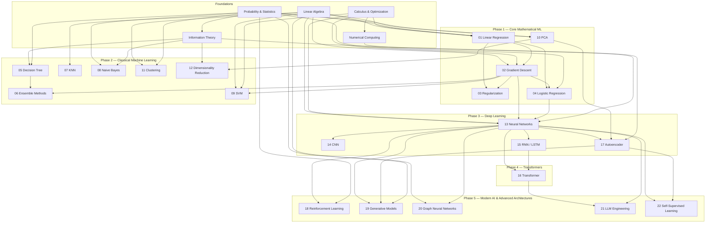
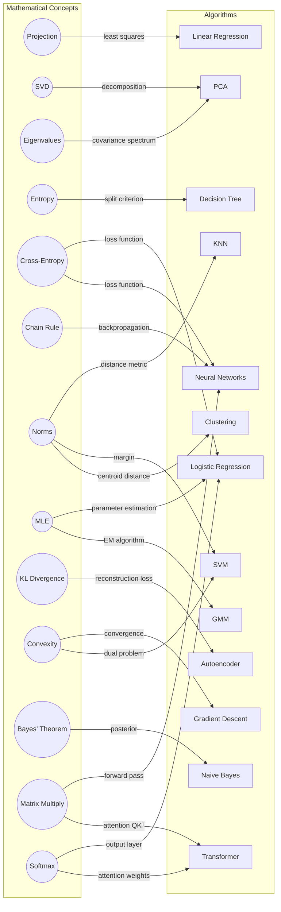

# Active Curriculum Index

This index covers the active First Principles curriculum: 22 topics across five phases.

## Mathematical Foundations

The mathematical prerequisites are maintained in the sister repository
[applied-mathematics-foundation](https://github.com/hien078/applied-mathematics-foundation).

| Foundation | Main concepts | Used heavily by |
|---|---|---|
| Linear Algebra | Projections, eigendecomposition, SVD, norms | Linear Regression, KNN, SVM, PCA, neural networks |
| Calculus and Optimization | Gradients, Hessians, Taylor approximation, convexity | Gradient Descent, Logistic Regression, SVM, neural networks |
| Probability and Statistics | Conditional probability, expectation, MLE/MAP | Linear/Logistic Regression, Naive Bayes, GMM |
| Information Theory | Entropy, cross-entropy, KL divergence | Trees, classification losses, t-SNE |
| Numerical Computing | Conditioning, stability, vectorization | Every computational topic |

## Topic Matrix

Maturity follows [NOTEBOOK_STANDARDS.md](NOTEBOOK_STANDARDS.md) §9: Planned → Draft →
Complete → **Verified** (Complete plus every §10 validation gate passing). This table is
the single source of per-topic maturity; other dashboards link here.

| # | Topic | Core idea | Main math | Prerequisites | Phase | Maturity |
|---:|---|---|---|---|---:|---|
| 01 | [Linear Regression](topics/01_linear_regression/README.md) | ŷ = Wx + b for continuous values | Projection, least squares | LA, Calculus, Probability | 1 | ✅ Complete |
| 02 | [Gradient Descent](topics/02_gradient_descent/README.md) | θ ← θ − α∇L(θ) | Gradients, smoothness, convexity | Calculus, 01 | 1 | 🏅 Verified |
| 03 | [Regularization](topics/03_regularization/README.md) | Penalize complexity: L1, L2, MAP | Norms, constrained optimization | 01, 02 | 1 | 🏅 Verified |
| 04 | [Logistic Regression](topics/04_logistic_regression/README.md) | σ(z) = 1/(1+e⁻ᶻ) → classification | Cross-entropy, MLE, convexity | Probability, 02 | 1 | 🏅 Verified |
| 05 | [Decision Tree](topics/05_decision_tree/README.md) | Recursive splits on impurity | Entropy, Gini, greedy search | Information Theory | 2 | 🏅 Verified |
| 06 | [Ensemble Methods](topics/06_ensemble_methods/README.md) | Bagging (RF) and boosting (GB) | Bootstrap, variance reduction | 05 | 2 | 🏅 Verified |
| 07 | [KNN](topics/07_knn/README.md) | Majority vote of K nearest points | Norms, metric geometry | Linear Algebra | 2 | 🏅 Verified |
| 08 | [Naive Bayes](topics/08_naive_bayes/README.md) | P(y\|x) via Bayes + independence | Bayes theorem, conditional independence | Probability | 2 | 🏅 Verified |
| 09 | [SVM](topics/09_svm/README.md) | Maximum-margin hyperplane | Convex optimization, KKT | LA, Optimization | 2 | 🏅 Verified |
| 10 | [PCA](topics/10_pca/README.md) | Max-variance projection | Covariance, eigenvalues, SVD | LA, Statistics | 1 | 🏅 Verified |
| 11 | [Clustering](topics/11_clustering/README.md) | K-Means, DBSCAN, GMM | Distances, density, EM | LA, Probability | 2 | ✅ Complete |
| 12 | [Dimensionality Reduction](topics/12_dimensionality_reduction/README.md) | LDA, t-SNE | Scatter matrices, KL divergence | 10, Information Theory | 2 | 🏅 Verified |
| 13 | [Neural Networks](topics/13_neural_networks/README.md) | Stacked linear + nonlinear layers | Chain rule, matrix calculus | 02, 04 | 3 | 🏅 Verified |
| 14 | [CNN](topics/14_cnn/README.md) | Convolution for spatial features | Cross-correlation, pooling | 13 | 3 | ✅ Complete |
| 15 | [RNN/LSTM](topics/15_rnn_lstm/README.md) | Recurrence for sequential data | BPTT, gating mechanisms | 13 | 3 | ✅ Complete |
| 16 | [Transformer](topics/16_transformer/README.md) | Self-attention: softmax(QKᵀ/√dₖ)V | Attention, positional encoding | 13 | 4 | ✅ Complete |
| 17 | [Autoencoder](topics/17_autoencoder/README.md) | Encode → latent → decode | Representation, reconstruction | 13 | 3 | ✅ Complete |
| 18 | [Reinforcement Learning](topics/18_reinforcement_learning/README.md) | MDPs, Q-Learning, Policy Gradient | Bellman equations, Markov property | Calculus, Probability, 13 | 5 | 🏅 Verified |
| 19 | [Generative Models](topics/19_generative_models/README.md) | VAE, GAN, Diffusion Models | ELBO, Wasserstein distance, SDEs | Probability, Calculus, 13, 17 | 5 | ✅ Complete |
| 20 | [Graph Neural Networks](topics/20_graph_neural_networks/README.md) | Spectral & Spatial Graph Convolutions | Graph Laplacian, Message passing | LA, Calculus, 13 | 5 | 🏅 Verified |
| 21 | [LLM Engineering](topics/21_llm_engineering/README.md) | Tokenization, PEFT (LoRA), DPO | Subword algorithms, rank decomposition | 13, 16 | 5 | 🏅 Verified |
| 22 | [Self-Supervised Learning](topics/22_self_supervised_learning/README.md) | Contrastive loss, MAE, SimCLR | InfoNCE, mutual information bound | Probability, 13, 17 | 5 | ✅ Complete |

The 8 topics still at *Complete* execute cleanly but have exercises below the
[NOTEBOOK_STANDARDS.md](NOTEBOOK_STANDARDS.md) §8 standard — deepening them is
[ROADMAP.md](ROADMAP.md) Phase 2.

## Prerequisite Graph

> Topics 5–9 and 10–12 can be studied in parallel once their prerequisites are met.

## Math-to-Algorithm Mapping

## Algorithm Families

| Family | Members | Common thread |
|---|---|---|
| Linear Models | LinReg, Ridge, Lasso, LogReg | Weighted sum of features + loss |
| Tree Models | Decision Tree, Random Forest, Gradient Boosting | Recursive partitioning |
| Distance-Based | KNN, K-Means, DBSCAN, Hierarchical | Proximity in feature space |
| Probabilistic | Naive Bayes, GMM, Logistic Regression | Explicit probability modeling |
| Subspace Methods | PCA, LDA, t-SNE, Autoencoder | Dimensionality reduction |
| Neural Architectures | MLP, CNN, RNN, Transformer, Autoencoder | Composable differentiable layers |

## 5 Mathematical Pillars of ML

| Pillar | Role | Examples |
|---|---|---|
| **Linear Algebra** | Data as matrices/vectors; the spine of every neural network | Matrix multiply in MLPs, SVD in PCA, attention QKᵀ |
| **Calculus** | Derivatives to minimize error — foundation of backprop | Chain rule, Jacobian, gradient descent |
| **Probability & Statistics** | Reasoning under uncertainty; parameter estimation | Bayes' theorem, MLE/MAP, cross-entropy |
| **Optimization** | Finding optimal parameters — broader than applied calculus | SGD, Adam, KKT (SVM), EM algorithm |
| **Information Theory** | Measuring information and distribution divergence | Entropy, KL divergence, mutual information, ELBO |

## Cross-Topic Navigation

- [Optimization methods](synthesis/optimization_methods_compared.md)
- [Loss functions](synthesis/loss_functions_map.md)
- [Bias–variance trade-off](synthesis/bias_variance_tradeoff.md)
- [Geometry of ML](synthesis/geometry_of_ml.md)
- [Probabilistic view](synthesis/probabilistic_view_of_ml.md)
- [Model selection](synthesis/model_selection_guide.md)
- [Supervised vs unsupervised](synthesis/supervised_vs_unsupervised.md)
- [Regularization across models](synthesis/regularization_across_models.md)
