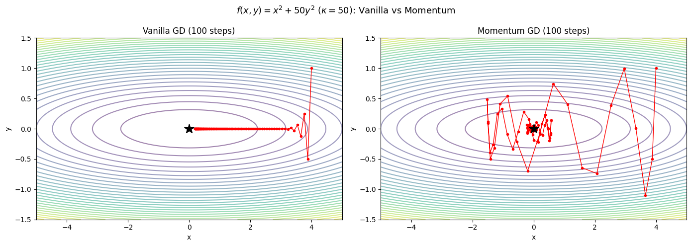
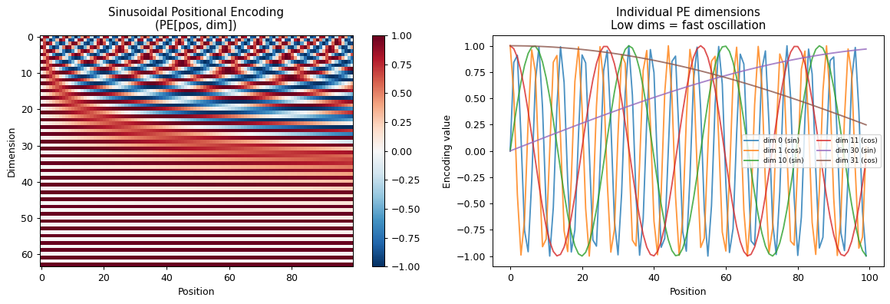
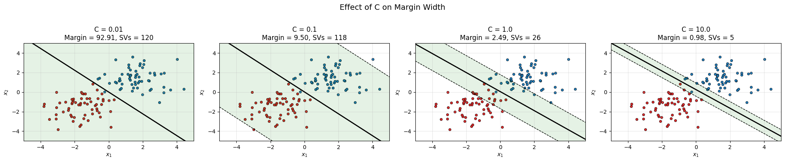
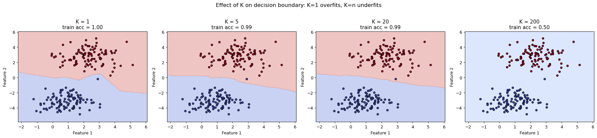
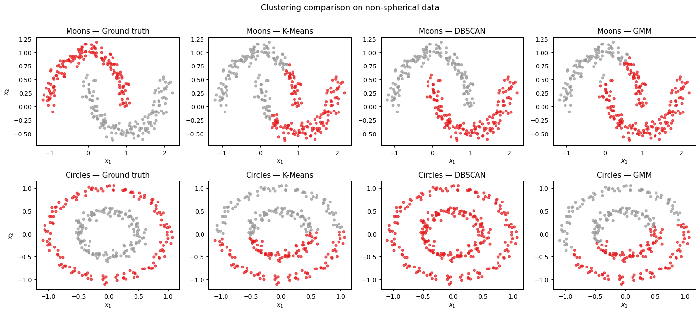
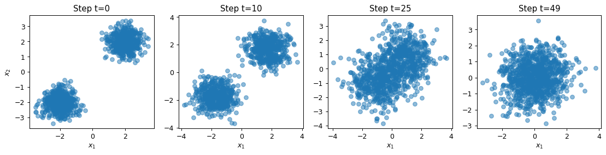

# Machine Learning from First Principles

> **Derive, implement, and verify machine learning algorithms from mathematical principles without black-box dependencies.**

[](https://www.python.org/)
[](https://en.wikipedia.org/wiki/First_principle)
[](https://github.com/hien078/Machine-Learning-from-scratch/actions/workflows/ci.yml)
[](LICENSE)
[](https://hien078.github.io/Machine-Learning-from-scratch/)

**Who this is for:** students and self-learners who want to understand *why* an algorithm works — every topic pairs a full mathematical derivation with a tested from-scratch implementation, not just a code dump.

> 📖 **Browse this curriculum as a website:** [hien078.github.io/Machine-Learning-from-scratch](https://hien078.github.io/Machine-Learning-from-scratch/) — rendered theory, executed notebooks, and cross-topic maps.

---

> 🧮 **Sister Repository:** For standalone, deep-dive mathematical prerequisites (Linear Algebra, Calculus & Optimization, Probability & Statistics, Information Theory, Numerical Computing), check out [applied-mathematics-foundation](https://github.com/hien078/applied-mathematics-foundation).

---

## 👀 What It Looks Like

Every figure below is a committed output of a topic notebook — derived on paper first, then reproduced from scratch and executed on a fresh kernel.

| | |
|---|---|
| [](topics/02_gradient_descent/first_principles.ipynb) **02 — Gradient descent:** vanilla vs momentum on an ill-conditioned quadratic | [](topics/16_transformer/first_principles.ipynb) **16 — Transformer:** sinusoidal positional encodings |
| [](topics/09_svm/first_principles.ipynb) **09 — SVM:** how `C` trades margin width for violations | [](topics/07_knn/first_principles.ipynb) **07 — k-NN:** `K=1` overfits, `K=n` underfits |
| [](topics/11_clustering/first_principles.ipynb) **11 — Clustering:** where K-Means breaks and DBSCAN doesn't | [](topics/19_generative_models/first_principles.ipynb) **19 — Generative models:** the forward diffusion process |

---

## 🎯 Core Philosophy

Machine Learning is applied mathematics and numerical computation. This repository strictly follows a **first-principles methodology**:

```text
Phenomenon & Motivation
→ Mathematical Formulation
→ Analytical Derivation
→ From-Scratch NumPy/PyTorch Implementation
→ Numerical Verification & Behavioral Tests
→ ML/AI Connections & Trade-offs
```

Every algorithm is built step-by-step from raw matrix operations and calculus before comparing with production libraries.

---

## 📂 Repository Structure

```text
Machine-Learning-from-scratch/
├── topics/                    # 22 algorithm modules + synthesis/ cross-topic maps
├── projects/                  # Applied capstones using the library end-to-end
├── src/ml_first_principles/   # Clean, installable Python library written from scratch
├── tests/                     # Unit tests & numerical regression suites
├── INDEX.md                   # Full curriculum index & prerequisite DAG
├── CONTRIBUTING.md            # Process, notebook standards, roadmap & decisions log
├── pyproject.toml             # Package metadata, dev extras, lint & test config
└── README.md
```

> 📐 **Mathematical Prerequisites** (Linear Algebra, Calculus, Probability, Information Theory, etc.) are maintained in the dedicated **[applied-mathematics-foundation](https://github.com/hien078/applied-mathematics-foundation)** repository.

---

## 🗺️ Topics & Curriculum

22 algorithm modules across five phases. **[INDEX.md](INDEX.md) is the single source of
truth** — full topic matrix with mathematical core, prerequisites, prerequisite DAG, and
per-topic maturity.

| Phase | Focus | Modules |
|---|---|---|
| 1 | Core Mathematical ML — least squares, optimization, regularization, MLE, spectral methods | `01`–`04`, `10` |
| 2 | Classical ML — trees, ensembles, metric and probabilistic methods, kernels, clustering | `05`–`09`, `11`, `12` |
| 3 | Deep Learning — backprop, convolution, recurrence, autoencoders | `13`–`15`, `17` |
| 4 | Transformers — scaled dot-product and multi-head self-attention | `16` |
| 5 | Modern AI — RL, generative models, GNNs, LLM engineering, self-supervised learning | `18`–`22` |

All 22 topics are 🏅 **Verified**: every gate of the
[Notebook Standards](CONTRIBUTING.md) (§10) passes.

---

## ⚡ Quick Start & Installation

### Prerequisites
- **Python 3.12+**
- Virtual environment (`venv` or `conda`)

### 1. Clone & Setup Environment

```bash
git clone https://github.com/hien078/Machine-Learning-from-scratch.git
cd Machine-Learning-from-scratch

python -m venv .venv
source .venv/bin/activate  # On Windows: .venv\Scripts\activate
```

### 2. Install Dependencies

```bash
pip install -r requirements.txt
pip install -e ".[dev]"   # library + pytest test tooling
```

> **Optional — PyTorch:** the library-comparison sections of topics 13–17 additionally
> import `torch`. Install it separately (`pip install torch`) to execute those notebooks;
> everything else runs on the pinned dependencies above.

### 3. Run Verification Tests

Ensure all algorithm implementations pass the unit test suite:

```bash
pytest
```

---

## 🚀 Applied Projects

The [projects/](projects/README.md) directory holds end-to-end capstones built on the
library: a tabular benchmark against sklearn, a from-scratch NumPy char-level
transformer, a digits autoencoder vs PCA study, and a Q-learning gridworld
analysis. Each trains in under 30 seconds, uses only bundled data, and commits
its generated report.

---

## 🔬 Software Engineering & Testing

All algorithm implementations inside `src/ml_first_principles/` are paired with automated regression tests in `tests/`:

- Linear Models, Optimizers, Tree Models, Ensembles
- Distance Metrics, Probabilistic Models, Neural Core, Visualization
- Phase 5 modules: RL (GridWorld, Q-Learning), Generative (VAE/GAN), GNN (GCN/GAT), LLM (BPE/LoRA/DPO), SSL (InfoNCE/MAE)
- Gradient checks, numerical stability checks, and package-export consistency

Every gate — lint, format, notebook format, types, tests with the coverage floor —
runs from one command, the same one CI runs:

```bash
mlfp check
```

Notebook execution is validated separately because it is slow:
`mlfp nb-exec` runs every notebook top-to-bottom on a fresh
kernel (add `--write` to refresh the committed outputs — the only sanctioned way to
produce them).

---

## 📄 License

This repository is released under the [MIT License](LICENSE).
