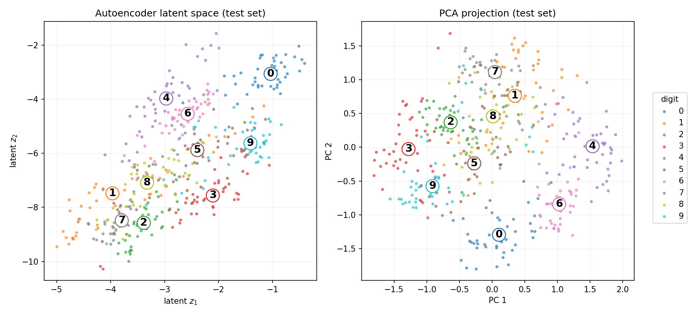
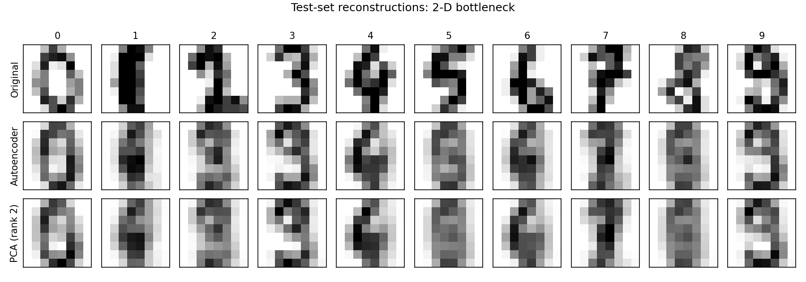

# Digits capstone report

Dataset: sklearn `load_digits` (1797 samples, 8x8 images, pixels scaled to [0, 1]), 1347 train / 450 test (stratified, seed 42).

## (a) Classification — from-scratch MLP vs sklearn baseline

| Model | Test accuracy |
|---|---|
| MLP 64-32-10 (nn_core + Adam, MSE on one-hot) | 0.9711 |
| sklearn `LogisticRegression` (lbfgs) | 0.9622 |

Final MLP training loss: 0.002796 after 400 full-batch Adam steps (lr = 0.01).

## (b) 2-D latent space — autoencoder vs PCA

Undercomplete autoencoder 64 -> 8 (ReLU) -> 2 -> 8 (ReLU) -> 64 (Sigmoid), trained with full-batch Adam (lr = 0.01, 3000 steps). PCA is computed from scratch via `numpy.linalg.eigh` on the training covariance matrix.

## (c) Reconstruction error — autoencoder vs rank-2 PCA

| Model (2-D bottleneck) | Test MSE per pixel |
|---|---|
| Autoencoder | 0.05206 |
| PCA (rank 2) | 0.05308 |

AE / PCA error ratio: 0.981

## Findings

- The from-scratch MLP reaches 97.1% test accuracy, above the logistic-regression baseline (96.2%), despite using plain MSE on one-hot targets rather than cross-entropy.
- Both 2-D embeddings separate visually distinct digits (0, 6, 4); the autoencoder's nonlinear encoder curves the space and pulls some classes apart more than PCA's linear projection, but with only 2 latent units several digit pairs (e.g. the loopy 8/9/3 group) still overlap in both.
- Through the same 2-D bottleneck, the nonlinear autoencoder reconstructs with lower error than rank-2 PCA (ratio 0.981): the ReLU layers let it use a curved 2-D manifold, while PCA is restricted to the best flat 2-D subspace.
- Reconstructions from 2 dimensions are heavily smoothed prototypes: per-sample stroke detail is lost, which is expected from a 32x compression.

Total wall time: 8.3 s (single CPU, deterministic, seed 42).
