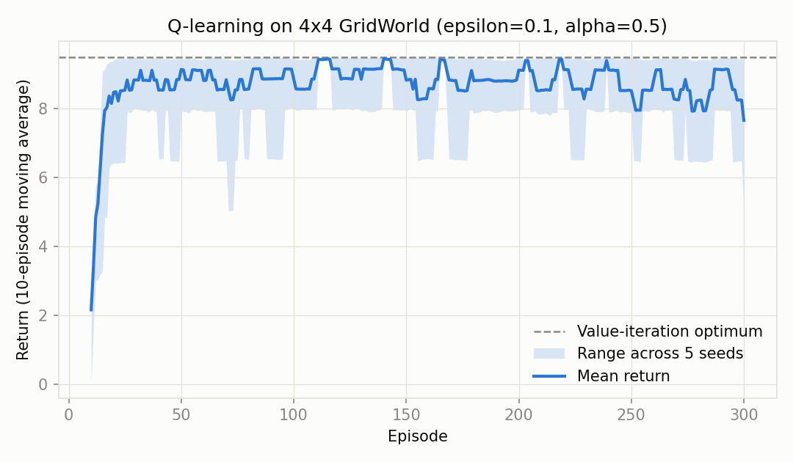
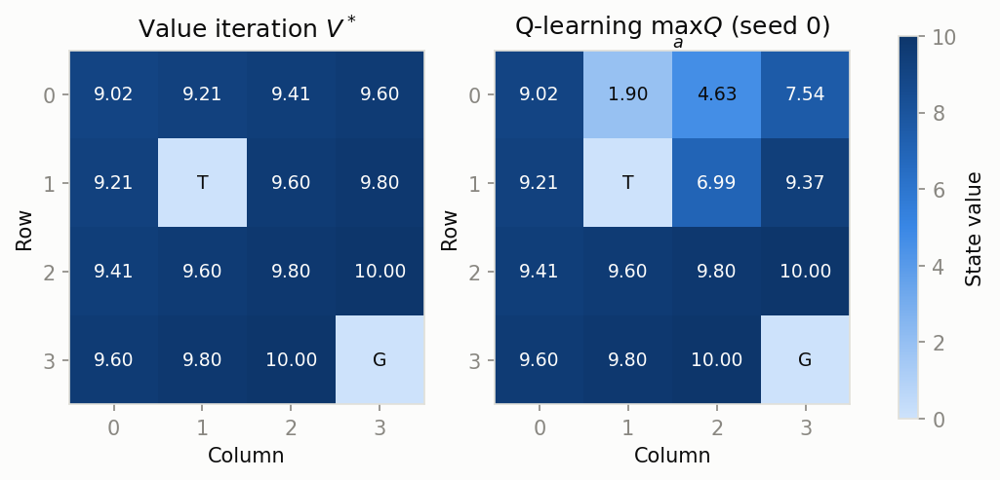

# GridWorld Q-learning vs Value Iteration

Generated by `src/rl_experiment.py` (deterministic; re-running reproduces this file byte-for-byte). Env: 4x4 grid, goal (3, 3), trap (1, 1), gamma=0.99, 300 episodes x 5 seeds (0, 1, 2, 3, 4).

## Learning curve



- Baseline config: epsilon=0.1, alpha=0.5.
- Final mean return (last 50 episodes, across seeds): **8.43** (per-seed range 7.96 to 9.12).
- Value-iteration optimal return from start: **9.50** (undiscounted; greedy rollout of the exact solution).
- Uniform-random policy baseline: **-3.44**.
- Greedy rollout of the trained policies: **9.50** -- the residual gap in the training curve is the epsilon-greedy exploration cost, not a policy error.

## Epsilon / alpha sweep

Scored by mean return over the final 50 episodes across 5 seeds. `agreement` is the fraction of non-terminal states whose greedy action is optimal under value iteration; `episodes to optimal` is the mean episode after which the greedy policy first achieves the optimal return.

| epsilon | alpha | tail mean return | greedy return | agreement | episodes to optimal |
|---:|---:|---:|---:|---:|---:|
| 0.05 | 0.1 | 9.35 **(best)** | 9.50 | 0.93 | 16 |
| 0.05 | 0.5 | 8.93 | 9.50 | 0.86 | 12 |
| 0.1 | 0.1 | 8.50 | 9.50 | 0.99 | 15 |
| 0.1 | 0.5 | 8.43 | 9.50 | 0.93 | 13 |
| 0.3 | 0.1 | 7.24 | 9.50 | 0.91 | 17 |
| 0.3 | 0.5 | 7.12 | 9.50 | 0.94 | 13 |

## Learned greedy policy

Arrows = greedy action, `G` = goal (+10), `T` = trap (-5). Left: value iteration. Right: Q-learning (seed 0, baseline config).

```
Value iteration        Q-learning
v > v v                v > > v
v T v v                v T v v
v v v v                v v > v
> > > G                > > > G
```

Ties note: several states have multiple optimal actions (equal path length to the goal), so the two grids may show different arrows at a state while both are optimal; `agreement` above counts an action as correct if it ties the value-iteration maximum.

## Value function



## Findings

- **Q-learning reaches the value-iteration optimum.** The greedy rollout of the trained baseline policies earns 9.50, matching the exact optimum 9.50 (true for every sweep config), and 93% of non-terminal greedy actions tie the optimal action values.
- **Alpha sets convergence speed.** In this deterministic env a large step size is safe: alpha=0.5 needs 13 episodes on average to make the greedy policy optimal vs 16 for alpha=0.1, while final greedy quality is identical.
- **Epsilon taxes the training return.** Mean tail return falls monotonically with exploration (epsilon=0.05: 9.14, epsilon=0.1: 8.47, epsilon=0.3: 7.18) because each random step risks the trap or a detour, which is why epsilon=0.05, alpha=0.1 wins the tail-return ranking; the exploration cost is paid during training only, not by the final greedy policy.
